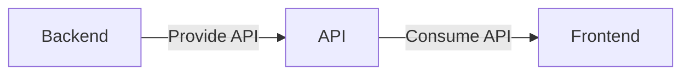

# Simple CRUD 

## Back end
### Tech
- Spring boot
- JPA
- MySQL

## Front end
### Tech
- React 
- React Router Dom
- Boostraps
- axios 

## Features

- Create user
- Read user
- Update user
- Delete user

And this will produce a flow chart:

## API's
- GET `http://localhost:8080/users` - > Get all users
- POST`http://localhost:8080/user` - > Add new user
- GET `http://localhost:8080/user/{id}` - > Get detail user
- PUT `http://localhost:8080/user/{id}` - > Update user
- DELETE `http://localhost:8080/user/{id}` - > Delete user

